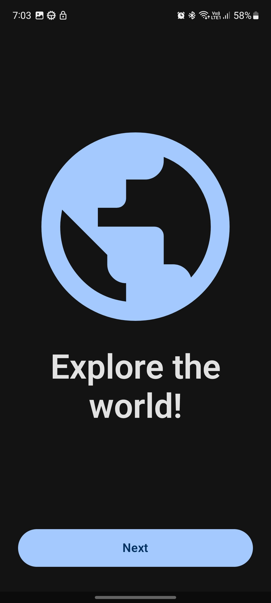
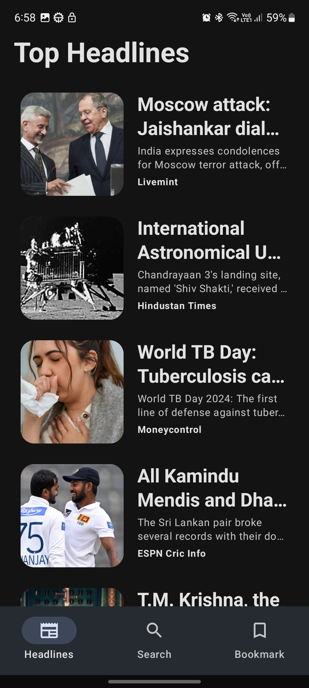
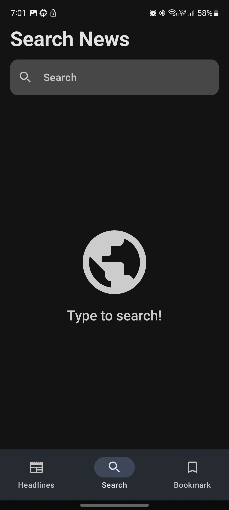
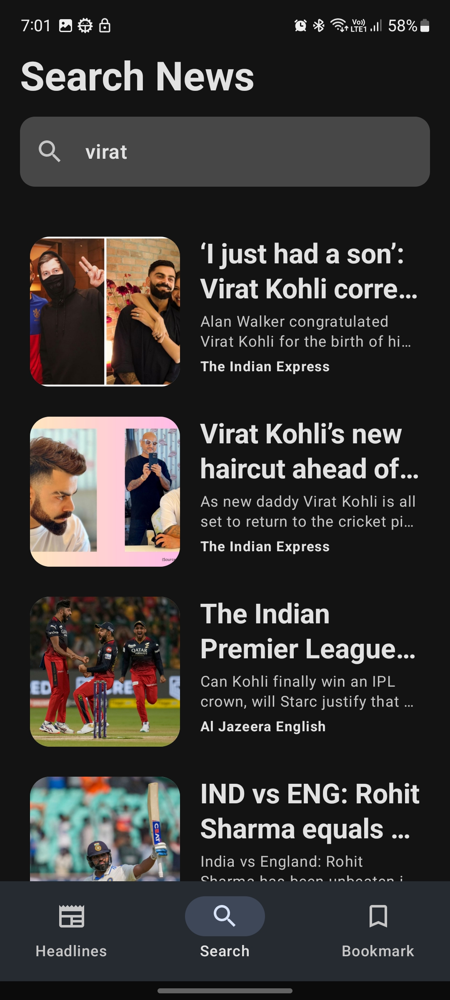
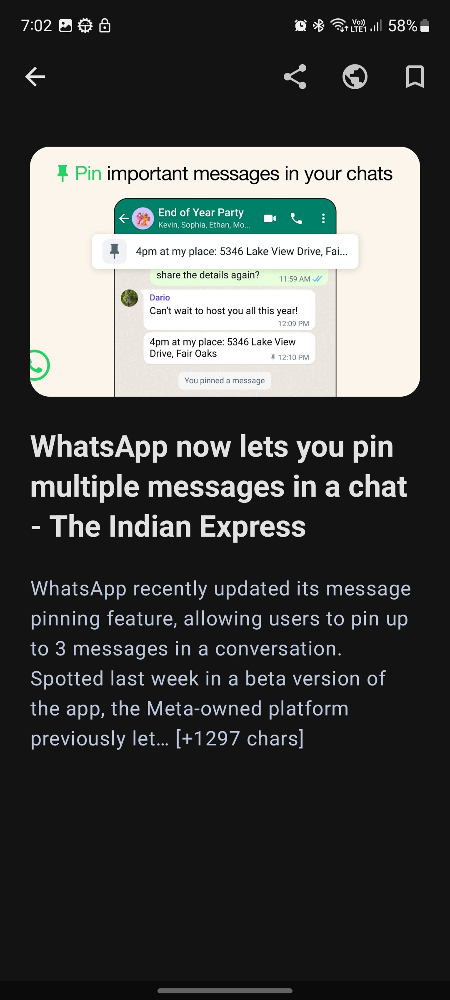
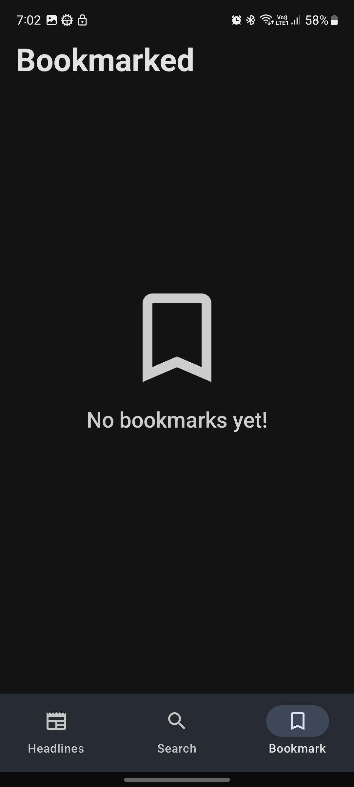

#  News App

[](https://github.com/zeph7/news-app/graphs/contributors)
[](https://kotlinlang.org/)

[](https://www.android.com/)

## Overview

It's a comprehensive android sample app designed to showcase the best practices in modern android development. Built with a focus on scalability, maintainability and efficiency, this project embodies the principles of MVVM architecture coupled with Clean Architecture methodologies. It emphasizes package level feature-based modularisation to ensure a well-structured and organized codebase.

## Features

* Stay Updated - Explore the day's top news headlines at your fingertips.
* Dive Deeper - Read detailed content from your favorite news articles.
* Personalized Search - Find news tailored to your interests with ease.
* Save for Later - Bookmark and access news articles offline for uninterrupted reading pleasure.

## Demo


## Screenshots

<div style="display:flex;">



</div>
<br/>
<br/>
<div style="display:flex;">



</div>
<br/>
<br/>
<div style="display:flex;">



</div>

## Architecture

The architecture of the app complies with each of the following five points:

* A single-activity architecture, using the navigation component to manage screen's navigation.
* Android architecture components, part of Android Jetpack, to project a robust design.
* Model-View-ViewModel facilitating a separation of concern.
* Clean Architecture to build a scalable, maintainable and efficient app.
* S.O.L.I.D design principles to make software designs more understandable, flexible and maintainable.
* Modular app architecture to develop features in isolation, independently from other features.

### Top-level package structure

* `core` contains all the common content for all the features and whole app navigation.
* `feature_auth` is intended to contain the authentication workflow, but has only onboarding section yet.
* `feature_news` contains all the code for news related features.

### Feature-level package structure

Each of the feature module contains the three main layers as in clean architecture:

* UI Layer - displays app data on the screen.
* Domain Layer - encapsulates business logic.
* Data Layer - provides data to the app.

```
⇀ feature
   ⇀ data
    ⇀ local
      ⇀ entity
    ⇀ remote
      ⇀ dto
    ⇀ mapper
    ⇀ preferences
    ⇀ repository

  ⇀ domain
    ⇀ model
    ⇀ repository
    ⇀ use_case

  ⇀ ui
    ⇀ common
    ⇀ sub_feature_1
    ⇀ sub_feature_2
    ⇀ ...

  ⇀ util
```


## Tech Stack

This project takes advantage of many popular libraries, plugins and tools of the Android ecosystem. Most of the libraries are in the stable version, unless there is a good reason to use non-stable dependency.

### Dependencies

* Android KTX - provide concise, idiomatic Kotlin to Jetpack and Android platform APIs.
* AndroidX - major improvement to the original Android Support Library.
* Jetpack Compose - Kotlin native UI development framework.
* Lifecycle - to use lifecyle aware components, like viewModelScope in viewmodels.
* Navigation - implement navigation, from button click to bottom bar navigation.
* Paging - load and display small chunks of data at a time.
* Room - persistence library provides an abstraction layer over SQLite.
* Datastore - persistence library to save preferences in key-value pairs offline.
* ViewModel - designed to store states, handle events and also survive configuration changes.
* Coroutines - managing background threads with simplified code and reducing needs for callbacks.
* Hilt - dependency injector for classes, to inject the required parameter dependencies.
* Retrofit - type-safe HTTP client to communicate with backend services.
* Coil - image loading library for Android backed by Kotlin Coroutines.
* Gson - makes it easy to parse JSON into Kotlin objects.
* Splash - handles splash screen for all api levels.

## Instructions

1. Clone or download the repo: `https://github.com/zeph7/news-app`.
2. Get your api key: `https://newsapi.org/`
3. Paste this line in local.properties `API_KEY = "YOUR-API-KEY"`
4. Navigate to the folder `news-app`.
5. Navigate to the folder `news-app/app/src/` to access developers content.
6. Navigate to the folder `apk` for users to access apk.
7. Copy the apk from folder `apk` to an android phone.
8. Install the apk.

- The app is finally installed on your Android mobile device !!
- To directly download the apk [click here](https://github.com/zeph7/news-app/tree/master/apk).

## Contributions

All contributions are welcome! Please feel free to post questions, recommendations, ideas, bugs by creating a new github issue or you can create a new pull request directly.

